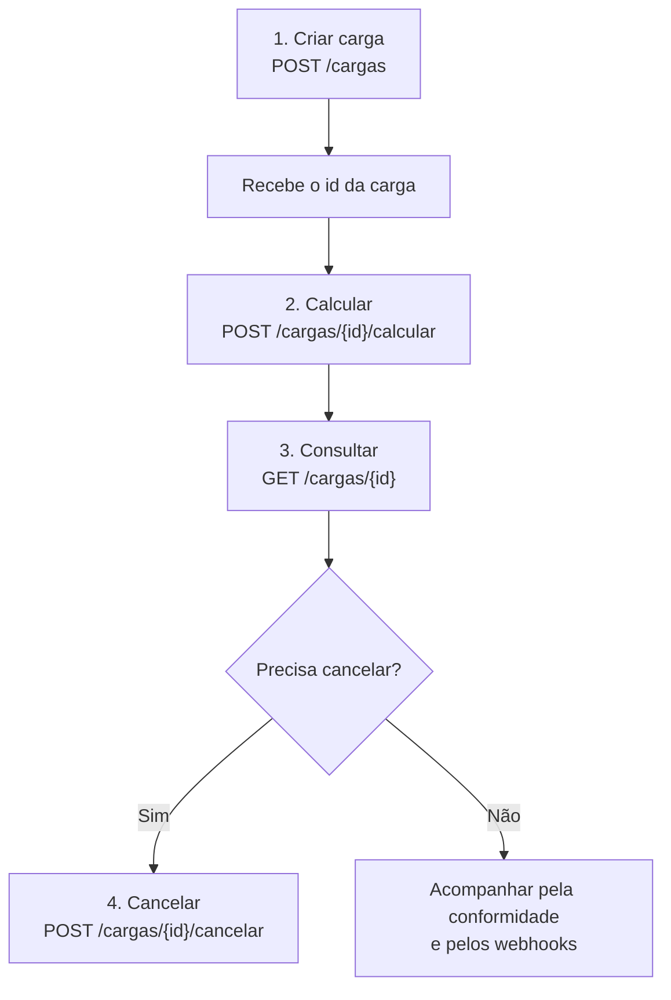

A calcANTT oferece duas formas de obter o frete mínimo da ANTT pela API, com propósitos diferentes:

- **Calculadora** (`POST /calculadora/calcular`): um cálculo avulso e imediato. Você envia os parâmetros e recebe o resultado na hora. Nada é armazenado.
- **Cargas**: um registro persistente do embarque. Você cria a carga, ela recebe um `id` e, a partir dele, você calcula, consulta, acompanha a conformidade e recebe webhooks.

## Comparativo rápido

| | Calculadora | Cargas |
| --- | --- | --- |
| Endpoint inicial | `POST /calculadora/calcular` | `POST /cargas` |
| Armazena o resultado | Não | Sim |
| Tem `id` e histórico | Não | Sim |
| Conformidade (`valorAtendido`) | Calculada na resposta | Armazenada no registro |
| Dispara webhooks | Não | Sim (`CARGA_CRIADA`, `CARGA_CALCULADA`, ...) |
| Melhor para | Cotação rápida, simulação | Registrar e auditar embarques reais |

## Quando usar a Calculadora

Use quando você só precisa do **valor**, sem guardar nada:

- Cotar um frete antes de fechar negócio.
- Simular cenários (número de eixos, distância, tipo de carga).
- Validar um valor de frete pontualmente.

É stateless: cada chamada é independente e nada fica registrado na calcANTT.

## Quando usar Cargas

Use quando o embarque precisa ser **registrado e acompanhado**:

- Manter histórico e trilha de auditoria por documento.
- Rastrear a conformidade (`valorAtendido`) ao longo do tempo.
- Receber webhooks quando a carga é criada, calculada, editada ou cancelada.

### Fluxo da API de Cargas

1. **Criar** a carga com `POST /cargas`. O endpoint faz upsert pela chave natural (`numero` + `serie` + `cnpjUnidade`) e retorna o **`id`**.
2. **Calcular** com `POST /cargas/{id}/calcular`. O resultado fica salvo no registro (`valorMinimo` e `valorAtendido`).
3. **Consultar** com `GET /cargas/{id}` para ver o status, a conformidade e o snapshot do cálculo.
4. **Cancelar** com `POST /cargas/{id}/cancelar` quando necessário (é irreversível).

<Note>
  A cada etapa, a calcANTT pode disparar [webhooks](/api-reference/webhooks) (`CARGA_CRIADA`, `CARGA_CALCULADA`, `CARGA_EDITADA`, `CARGA_CANCELADA`) para o seu sistema ser avisado em tempo real, sem ficar consultando a API.
</Note>

<Tip>
  Dá para combinar as duas: use a **Calculadora** para cotar na hora e, quando o frete for fechado, registre em **Cargas** para manter o histórico e a conformidade.
</Tip>
